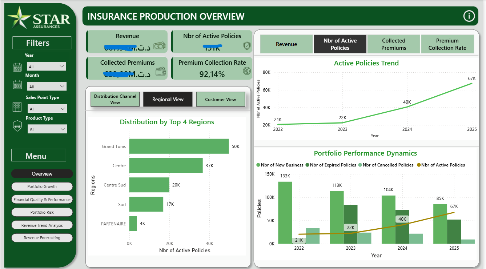

# 📊 Design and Implementation of a Decision Support System for Production Analysis

## 📌 Project Overview

This Final Year Project was carried out within **STAR Assurance** with the objective of designing and implementing a **Business Intelligence decision-support solution dedicated to insurance production analysis**.

In a competitive and data-driven environment, insurance companies generate large volumes of operational data from different systems, including policies, customers, payments, accounting transactions, and commercial activities. When these data are dispersed and underexploited, they become difficult to analyze and provide limited support for decision-making.

The proposed solution transforms raw insurance data into meaningful and actionable information through a complete Business Intelligence pipeline combining:

* 🗄️ **Production Data Mart**
* 🔄 **ETL processes**
* 📊 **Power BI dashboards**
* 🤖 **Data Mining and Machine Learning**
* 🔮 **Revenue forecasting**
* 👥 **Customer segmentation using K-Means**
* 🌐 **Web application for secure dashboard access**

The solution enables users to monitor production performance, analyze portfolio evolution, identify customer segments, evaluate financial quality and portfolio risk, and support data-driven decision-making.

---

## 🎯 Project Objectives

The main objectives of the project were to:

* Centralize and structure insurance production data.
* Design a dedicated **Production Data Mart**.
* Implement reliable ETL processes for data integration and transformation.
* Develop interactive Power BI dashboards for production monitoring.
* Define relevant KPIs to support business analysis.
* Apply data mining techniques to extract additional insights.
* Segment customers using **K-Means clustering**.
* Forecast future revenue using time-series models.
* Provide secure access to reports and dashboards through a web application.

---

## 🏗️ Solution Architecture

The solution follows a complete Business Intelligence workflow:

**Source Systems → ETL → Production Data Mart → Data Mining → Power BI → Web Application**

The architecture integrates data engineering, business intelligence, data visualization, predictive analytics, and application development into a single decision-support solution.

---

## 🗄️ Production Data Mart

A **Production Data Mart** was designed following the **Kimball dimensional modeling approach**.

The data warehouse structure is based on a **Star Schema**, consisting of:

* A central production fact table
* Several descriptive dimensions
* Business measures and calculated KPIs

This structure facilitates multidimensional analysis and improves the accessibility of production information for reporting and decision-making.

---

## 🔄 ETL Process

The ETL pipeline was implemented using **Talend Open Studio**.

The process includes:

1. **Extraction** of data from source systems
2. **Transformation** and cleansing of the data
3. **Integration** of the transformed data
4. **Loading** into the Production Data Mart

A staging area was also used as an intermediate layer during the data integration process.

---

## 📊 Power BI Dashboards

Interactive dashboards were developed with **Power BI** to provide decision-makers with a comprehensive view of insurance production performance.

The dashboards cover several analytical areas, including:

* 📈 Production performance
* 📊 Portfolio growth
* 💰 Financial quality
* ⚠️ Portfolio risk
* 💵 Revenue trends
* 🔮 Revenue forecasting

### Key Performance Indicators

The solution includes KPIs such as:

* **Total Premium**
* **Revenue**
* **Active Policies**
* **Collected Premiums**
* **Premium Collection Rate**

### Dashboard Preview



---

## 🤖 Data Mining & Predictive Analytics

Data mining techniques were integrated into the solution to go beyond descriptive reporting and provide additional analytical insights.

### 👥 Customer Segmentation — K-Means

The **K-Means clustering algorithm** was used to segment customers according to similarities in their characteristics and behavior.

This segmentation helps identify distinct customer groups and supports more targeted business analysis.

### 🔮 Revenue Forecasting

Time-series forecasting models were implemented to estimate future revenue trends.

The forecasting component provides an additional perspective for monitoring expected production and supporting future planning.

---

## 🌐 Web Application

A web application was developed to provide secure access to the Power BI reports and dashboards.

The application includes:

* 🔐 Secure authentication
* 👤 User management
* 🔑 Permission-based access
* 📊 Dashboard and report access

This integration makes the Business Intelligence solution accessible through a centralized application while controlling access according to user permissions.

---

## 🛠️ Technologies Used

| Category              | Technologies                 |
| --------------------- | ---------------------------- |
| Database              | Oracle SQL                   |
| ETL                   | Talend Open Studio           |
| Data Warehouse        | Star Schema / Kimball        |
| Business Intelligence | Power BI                     |
| Data Mining           | Python, Jupyter Notebook     |
| Machine Learning      | Scikit-learn                 |
| Clustering            | K-Means                      |
| Forecasting           | Time-Series Models           |
| Web Application       | PHP/MySQL/phpMyAdmin         |

---

## 📁 Project Structure

```text
decision-support-system-production-analysis/
│
├── README.md
│
├── data/
│   └── README.md
│
├── sql/
│   ├── staging/
│   ├── dimensions/
│   └── facts/
│
├── etl/
│   └── talend/
│
├── data-mining/
│   ├── clustering/
│   └── forecasting/
│
├── powerbi/
│   └── dashboards/
│
├── web-app/
│
├── documentation/
│
└── screenshots/
    ├── dashboard-01.png
    ├── dashboard-02.png
    └── dashboard-03.png
```

---

## 📈 Key Contributions

This project combines several components of a modern Business Intelligence solution:

**Data Integration → Data Warehouse → Business Intelligence → Data Visualization → Data Mining → Predictive Analytics → Web Integration**

The resulting solution helps STAR Assurance improve data analysis, production monitoring, performance evaluation, forecasting, and data-driven decision-making.

---

## 🎓 Academic Context

**Final Year Project — Business Intelligence**

**Host Organization:** STAR Assurance

**Specialization:** Business Intelligence

**Approach:** Kimball Dimensional Modeling + ETL + Business Intelligence + Data Mining

---

## 👩‍💻 Author

**Eya Gharbi**

Business Intelligence Graduate
